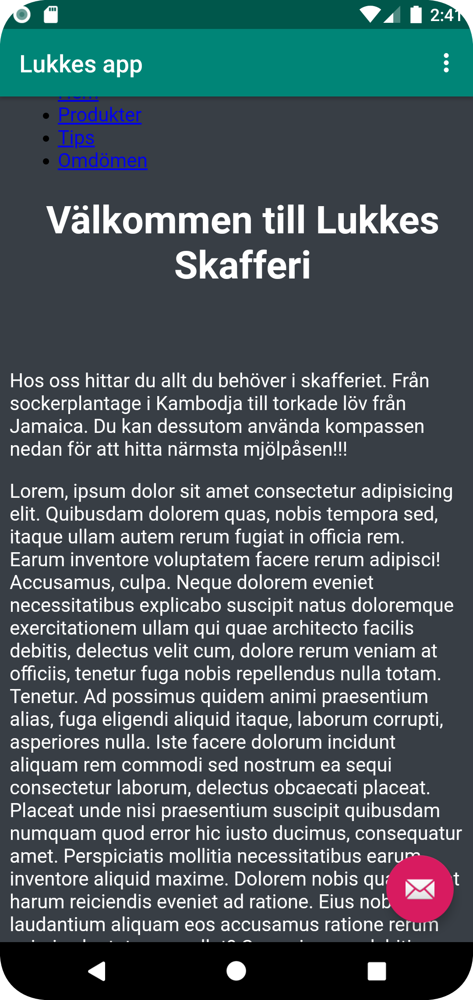
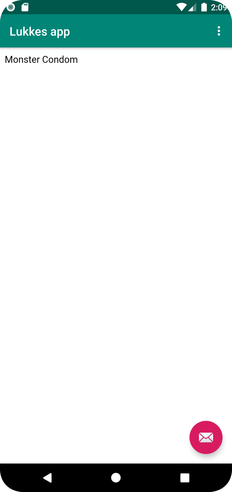

# Rapport

Rename your App. Hint: `res/values/strings.xml`
Jag ändrade namn på appen inuti "strings.xml" filen.
```
<string name="app_name">Lukkes app</string>
```

Enable Internet access for your App. Hint: `AndroidManifest.xml`
För att tillåta användning av internet i appen använde jag mig av uses permission funktionen.

```
<uses-permission android:name="android.permission.INTERNET"/>
```

Create a WebView element in the layout file `content_main.xml` by replacing the existing `TextView`
För att lösa detta gick jag in i "content_main.xml" och ändrade "TextView" till "WebView".

```
<WebView

/>
```

Give the WebView an ID. Hint: `android:id="@+id/my_webview"`
Inuti det WebView element som tidigare skapades sattes ett ID. Detta ID fick sedan namnet "my_webview".

```
android:id="@+id/my_webview"
```

Create a private member variable called `myWebView` of the type `WebView` and instantiate it in `onCreate()`. Hint: `findViewById()`
Inuti "MainActivity.java" skapades en "WebView" variabel. Denna användes sedan i "onCreate()" där funktionen "findViewById()" användes för att hitta variabeln.

```
WebView myWebView;
myWebView = findViewById(R.id.my_webview);
```

Locate the WebView element created in step 1 using the WebView ID
Detta löstes på samma sätt som tidigare uppgift. Det vill säga genom att använda "findViewById()".

```
myWebView = findViewById(R.id.my_webview);
```

Enable Javascript execution in your WebViewClient. Hint: `getSettings()` and `setJavaScriptEnabled()`
För att lösa detta användes "getSettings()" och därefter "setJavaScriptEnabled()" där värdet inuti parentesen är "true" för att tillåta Javascript i appen.

```
myWebView.getSettings().setJavaScriptEnabled(true);
```

Add a html page as an asset.
För att lösa detta skapades en ny asset mapp. Inuti denna mapp skapades sedan en html fil med enkel html kod inuti.

Implement `showExternalWebPage()` and `showInternalWebPage()`. Hint: `loadUrl()`.
För att lösa detta användes funktionen "myWebView.loadUrl" för att länka till både den interna samt den externa hemsidan genom appen.

```
myWebView.loadUrl("https://wwwlab.iit.his.se/a21lukpo/Mobilappdesign/AppPrototyp/");

myWebView.loadUrl("file:///android_asset/vadjagvill.html");
```

Call `showExternalWebPage()` and `showInternalWebPage()` when menu dropdown is clicked. Hint: `onOptionsItemSelected()`.
Inuti funktionen "onOptionsItemSelected()" la jag till "showExternalWebPage" samt "showInternalWebPage" för att kalla på dessa funktioner.showExternalWebPage

```
showExternalWebPage();

showInternalWebPage();
```



